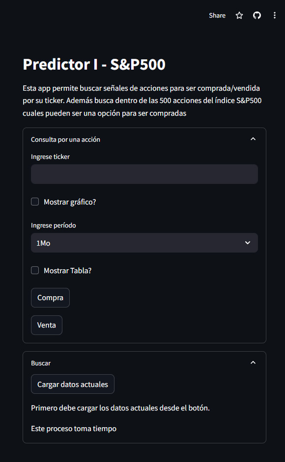

# PrediccionMercadosFinancieros
Este proyecto permite graficar acciones individuales y buscar en que fechas se encuentran barata para la compra o caras para la venta.
A su vez busca dentro del índice S&P500 cuales están baratas por fehca.

La aplicación desarrollada se conecta a la API de yahoo finance.

La información obtenida es solo de carácter educativo. Sea responsable con el uso de la información.

Cualquier comentario es bienvenido
link de la app:
https://prediccionmercadosfinancieros-6cppnyizkznokropw9neao.streamlit.app

